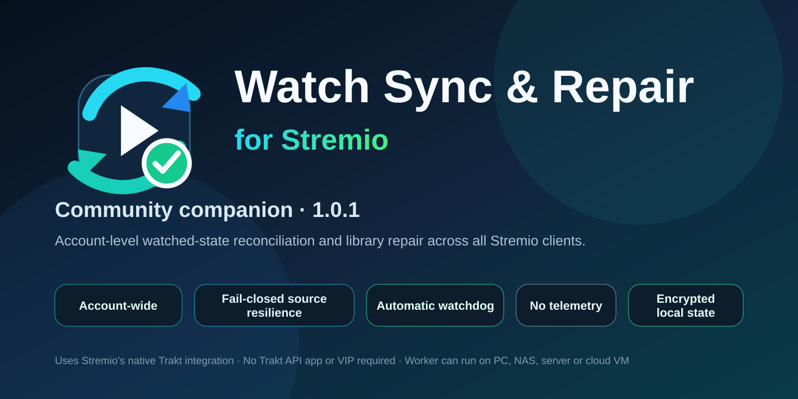

# Watch Sync & Repair for Stremio

A community reference implementation and one-time account repair harness for two jobs that Stremio installations can otherwise leave inconsistent:

1. reconcile supported **watched state** using Stremio's existing native Trakt integration; and
2. repair reviewed **stale poster URLs** already stored in Stremio LibraryItems.

It is **not** a streaming addon, metadata replacement, proxy, recommendation engine or playback scrobbler. There are no public addon endpoints. The optional management dashboard binds to `127.0.0.1` only. It is a reference, diagnostic and one-time repair harness; it is not the intended permanent cross-device sync authority.

## Native Trakt integration

There is **no Trakt API application to create**, no client ID/secret to enter and no VIP requirement. Connect Trakt in Stremio as normal. Stremio owns OAuth and normal playback scrobbling. Watch Sync & Repair reads the linked Trakt watched history through Stremio's own Trakt service and can repair reviewed Trakt → Stremio watched-state differences.

A Stremio-only historical flag that was never scrobbled to Trakt is reported as an outbound/native difference. The tool deliberately does not impersonate Stremio's OAuth client or make direct Trakt API history mutations.

## Safety first

The default configuration performs **no account writes** and runs **no schedule**. Changes require a preview plan, fresh-state validation, bounded scope and readback verification. Stremio whole-record mutations are protected by quiet-period checks, complete-record hashes, encrypted backups and strict field allowlists.

Unknown or unavailable data is never interpreted as unwatched. Unsupported IDs and unresolved episode mappings are isolated. Intentional Trakt → Stremio watched → unwatched changes require repeated complete observations plus explicit confirmation.

Outbound HTTP is HTTPS-only, exact-host allowlisted and protected against private-network/DNS-rebinding targets. Secrets and state are encrypted locally with AES-256-GCM. Release archives exclude account data, keys, exports and local configuration.

## Resilient source handling

Transient failures use bounded retries, `Retry-After` where available and per-source cooldowns. A metadata 404 may use an explicitly configured fallback; security failures never trigger a fallback. Stremio's Trakt history endpoint failing or being unavailable stops reconciliation rather than inventing state.

Cinemeta remains the authority for Stremio series watched-bit ordering. During Cinemeta downtime, a series may use only its own previously validated mapping. A new/unproved series is isolated until authoritative mapping returns. Poster candidates must use an allowed host and can be reachability/MIME checked before they enter a write plan.

See `docs/RESILIENCE.md` and `docs/THREAT-MODEL.md` for the detailed failure matrix and trust boundaries.

## Requirements

- Node.js **22.14 or newer**.
- A Stremio account.
- Trakt connected **inside Stremio** if watched reconciliation is wanted. No Trakt developer application or VIP subscription is required by this tool.
- A metadata source only if poster repair is wanted. Supported public configuration is an HTTPS Stremio-style upstream metadata endpoint and/or TMDB.

## Download

The current hardened reference build is **1.0.1**. Download the source ZIP and matching SHA-256 file from [GitHub Releases](https://github.com/ThiaJay/stremio-watch-sync-repair/releases). Verify the checksum before extracting.

## Quick start

1. Extract the source into a user-controlled folder.
2. Copy `config.example.json` to `config.json` if the launcher has not created one.
3. On Windows, open **`Open Watch Sync & Repair for Stremio.vbs`**. Other platforms can run `npm start` and use `npm run status` / `node src/cli.js dashboard-url` locally.
4. Connect Stremio from the local dashboard. If Trakt is not already linked, choose **Connect Trakt through Stremio** and complete Stremio's normal authorisation flow.
5. Save an optional metadata source/TMDB token if poster repair is required.
6. Preview watched reconciliation or poster repair with writes still disabled.
7. Use **Compare Stremio ↔ Trakt** for a reviewed reconciliation or the hardened `reconcile-safe-now` CLI for a one-time positive-only account repair. The production cross-device solution belongs in Stremio Core/account integration.

Safe older configs and the old `STREMIO_GUARD_CONFIG` / `GUARD_MASTER_KEY` environment aliases are accepted for migration. Deprecated direct-Trakt credentials are purged during native-integration migration; an old reconciliation baseline is preserved as an encrypted recovery backup and re-baselined safely.

## Cross-device strategy

Corrections made by the reference harness are written to the shared Stremio account and therefore appear on every client using that account. The harness is not intended to stay running on one device. The permanent solution is the native Stremio Core/account fix described in `docs/UPSTREAM-STREMIO.md`.

## Community customisation

Profiles can configure inbound unwatch confirmation cycles, batch limits, schedule intervals, metadata provider order, languages, poster fields, source retry/cooldown policy and exact outbound host allowlists. Security-sensitive values are schema-bounded. See `docs/CUSTOMISATION.md`.

## Development

There are **no runtime npm dependencies**. Run `npm test`, then `npm run verify` against a sealed release tree. Security-sensitive changes should add adversarial regression coverage. See `CONTRIBUTING.md` and `SECURITY.md`.

## Privacy and affiliation

No telemetry is included. The linked Trakt access token is read from Stremio only in memory when Stremio's own history service is queried; it is not copied into this tool's secret store. History exports are private user data. This project is community software and is **not affiliated with or endorsed by Stremio or Trakt**. TMDB is an optional integration and is credited in the dashboard About/Credits section. Third-party names and trademarks belong to their respective owners.

Licensed under MIT; see `LICENSE` and `THIRD-PARTY-NOTICES.md`.
